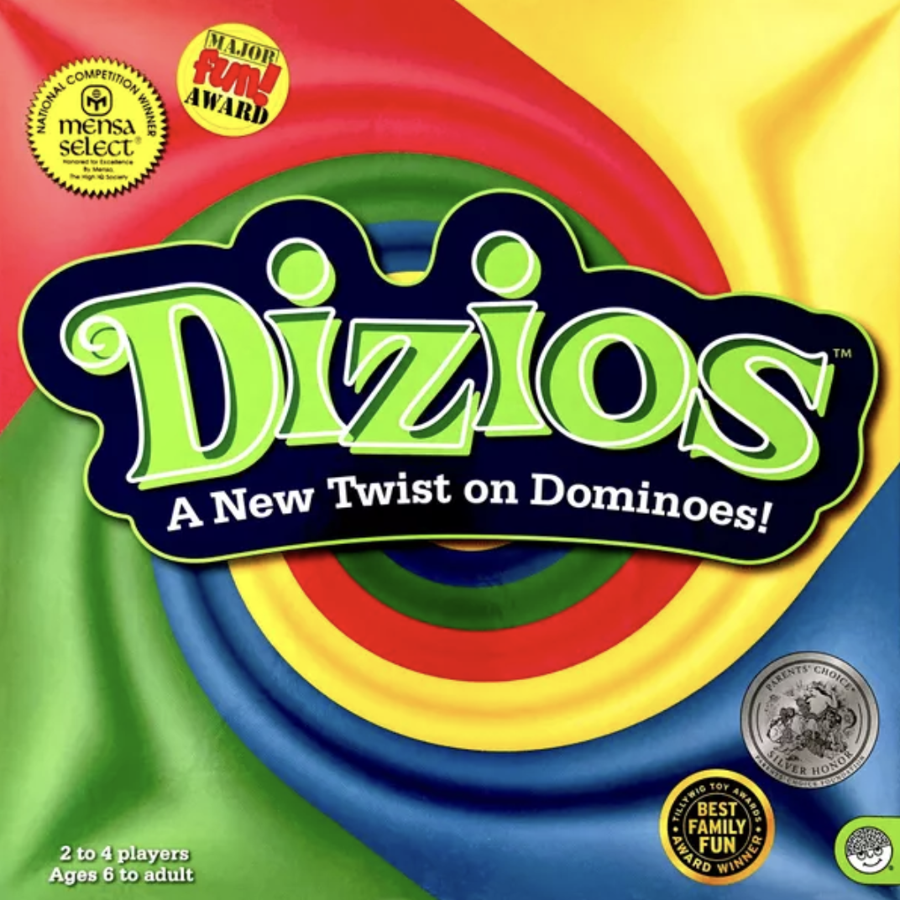
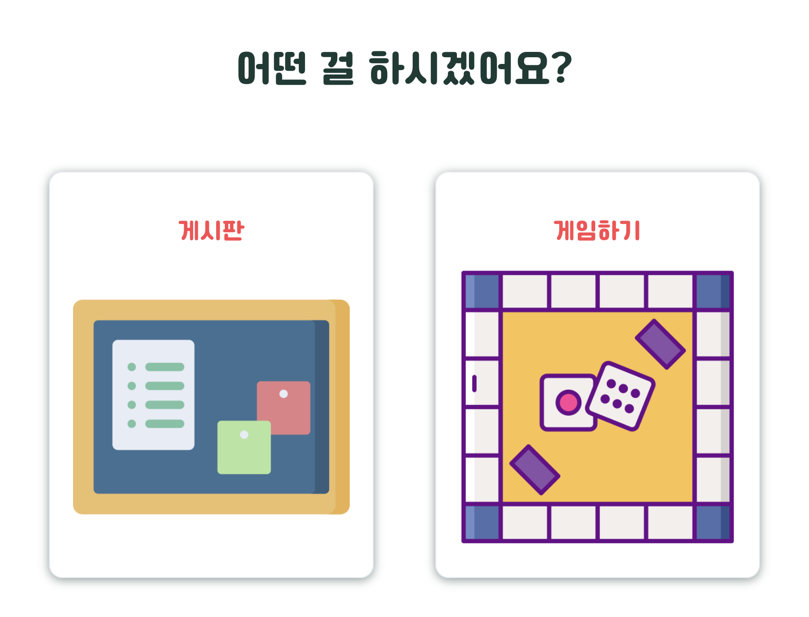
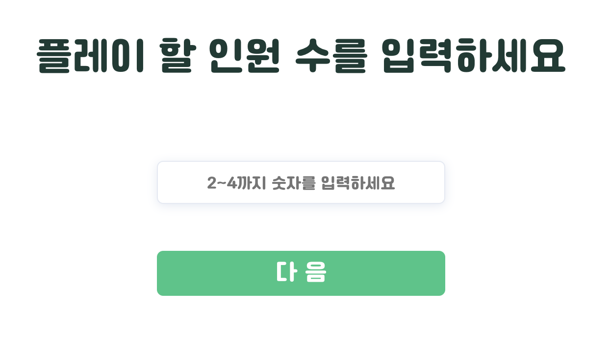
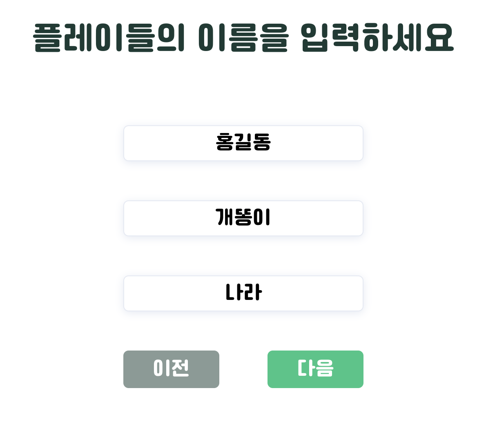
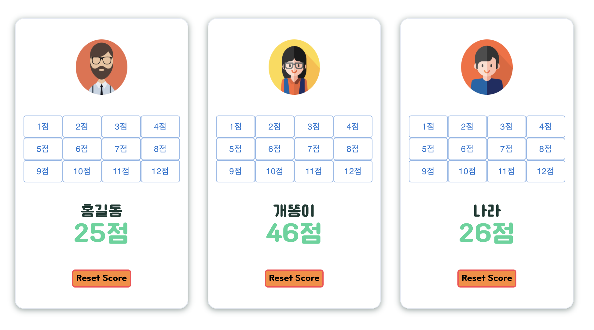
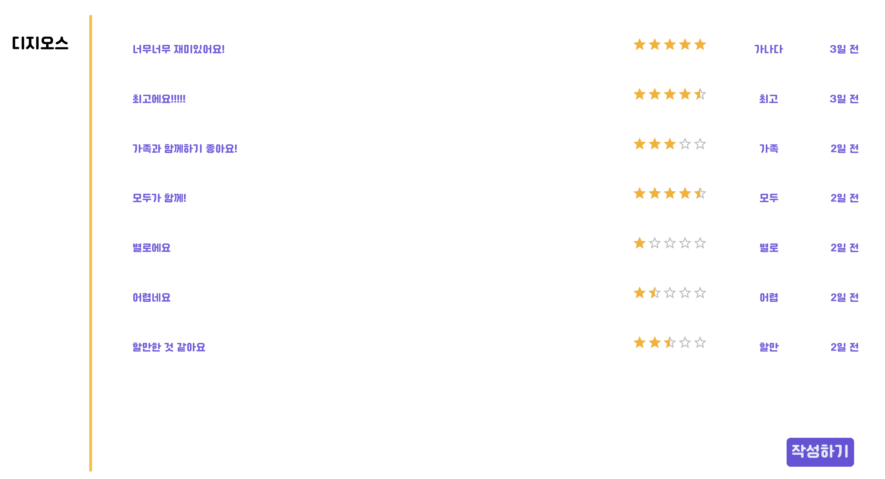
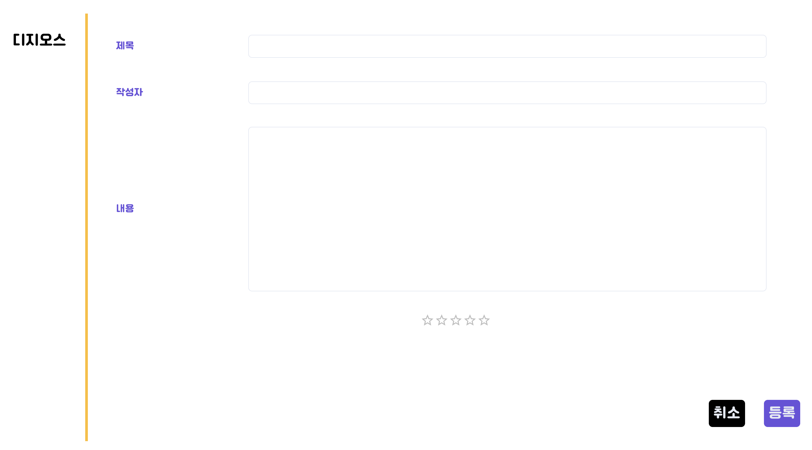
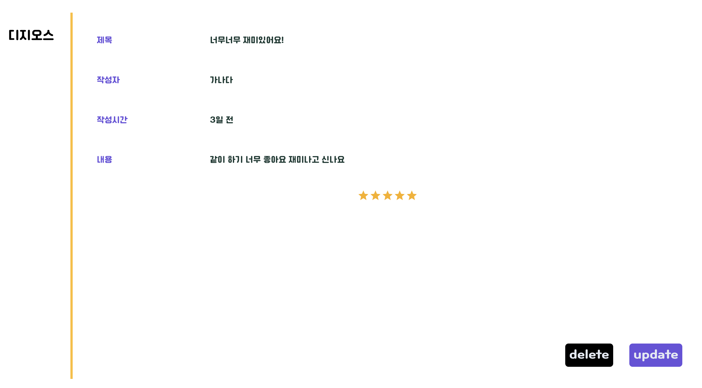

# 🎲 디지오스(보드게임)를 도와주는 스코어보드 및 커뮤니티, Dizi-Score

 
 

# 🎬 서비스 링크

> [클릭하시면 서비스 페이지로 이동합니다.](https://chickenjang.github.io/DiziScore)

 

# 🔊 프로젝트 소개

> 가족들과 보드게임을 하면서 점수 계산에 대해 불편함을 느꼈고, 이를 개선해보고자 만들어보게 되었습니다.

> 보드게임을 이용하는 사용자가 게임에만 더 편하게 집중할 수 있도록 도와주는 점수 기록판을 만들어 보았습니다.

> 추후 다른 종류의 보드 게임에도 적용하여, 게임별 Score Board를 만들고, 이를 기반으로 확장하여 커뮤니티를 만들어 갈 수 있을 것으로 기대됩니다.

 

# 🎨 페이지별 화면

|                                                    |        |                                                      |
| -------------------------------------------------- | -------------------------------------------------- | ---------------------------------------------------- |
|                                                    | 
메인화면
                 |                                                      |
|   |  |    |
| 
게임 플레이어 숫자
       | 
게임 플레이어 이름
       | 
게임 스코어
                |
|  |   |  |
| 
게시판 메인
              | 
게시판 새 글 작성
        | 
게시판 상세
                |

 

# 🛰 기술스택

 

# 📭 기타

> 프로젝트와 관련한 상세한 사항은 [노션페이지](https://www.notion.so/self-introduction-jiwon/Dizi-Score-e0ebda1e8073447ca91111733aa4f705)를 참고 부탁 드립니다.
